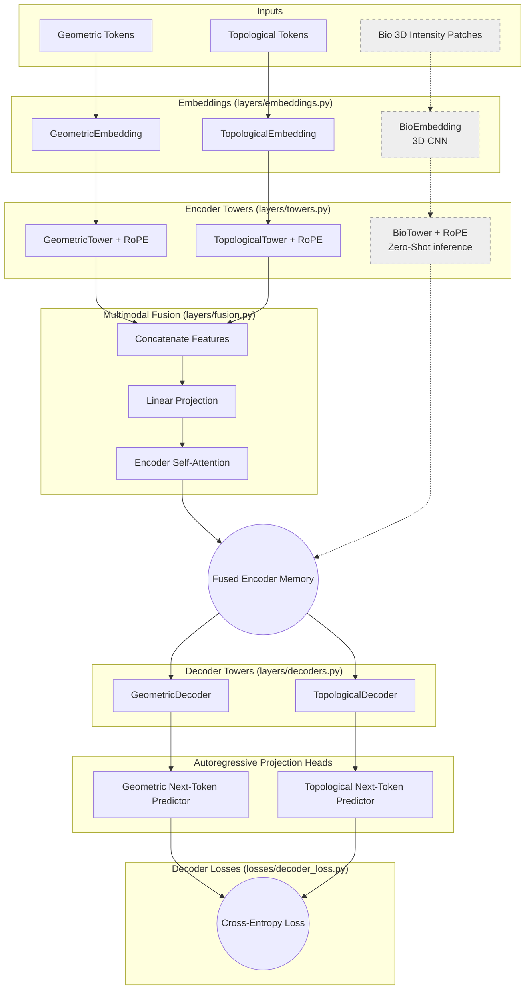

# NeuroGramLM System Architecture

This document provides a comprehensive structural view of the NeuroGramLM architecture, detailing the inputs/outputs, the flow of data through the individual PyTorch components, and the applied loss functions.

## 1. High-Level Architecture Diagram (Encoder-Decoder)

The architecture uses a full multi-tower Encoder-Decoder mechanism. During training, the Bio Tower is bypassed due to missing data. At test time, the Decoder relies on the Bio Tower's zero-shot intensity ridge encodings to validate generated gaps.

---

## 2. Component Descriptions & Flow

### A. Inputs & Outputs (IO)
**Inputs (`batch`):**
- **Geometric `vq_ids`**: Integer tensors for tortuosity, curvature, inertia.
- **Topological IDs**: Integer tensors for Strahler, WL Hash.
- **`bio_volumes`**: A `(batch, seq_len, 1, D, H, W)` volumetric tensor representing the raw image intensity patches along a gap/ridge.

**Outputs:**
- `geom_logits`: Predictions for the next geometric VQ IDs in the sequence.
- `topo_logits`: Predictions for the next topological integers.

### B. Embeddings (`layers/embeddings.py`)
- **Use:** Maps discrete integer inputs and continuous volume patches into dense `d_model` vectors.
- **Mechanism:** Geometric/Topological tokens use standard embedding lookups. The `BioEmbedding` utilizes a **3D CNN** to extract spatial features from the volumetric image patches before projecting them to `d_model`.

### C. Multi-Tower Encoders & Fusion (`layers/towers.py`, `layers/fusion.py`)
- **Use:** Encodes the fragment context.
- **Mechanism:** Geometric and Topological streams process independently and are then fused into `encoder_memory`. At test time (zero-shot), the `BioTower` encodes the intensity ridge between fragments and adds it to the memory pool.

### D. Multi-Tower Decoders (`layers/decoders.py`)
- **Use:** Generates the bridging sequence connecting two fragments.
- **Mechanism:** Uses masked self-attention over previously generated tokens, and **cross-attention** over the `encoder_memory` (which includes the Zero-Shot Bio features at inference time). It predicts both geometry and topology concurrently using independent decoder towers.

### E. Decoder Loss (`losses/decoder_loss.py`)
- **Use:** Autoregressive training.
- **Mechanism:** Standard Cross-Entropy applied over the decoder logits against shifted target sequences.
