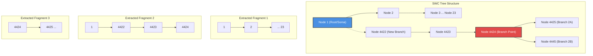

# NeuroGramLM Tokenization Architecture

This document provides a comprehensive overview of the tokenization scheme used in **NeuroGramLM**. It breaks down the internal structure of generated tokens, explains the purpose of each component, outlines how these tokens are utilized during language model (LM) training, and provides a real-world example of the tokenization process.

---

## 1. Introduction

In standard Natural Language Processing (NLP), text is broken down into discrete "words" or sub-words. However, when dealing with 3D neuron morphologies (SWC files), the raw data consists of continuous coordinates and tree topologies. 

The **NeuroGramLM Tokenization Pipeline** bridges this gap. It processes unbranched fragments of a neuron and translates physical, continuous biological measurements into structured, multimodal tokens that a transformer-based language model can natively understand.

---

## 2. Token Structure Breakdown

Each token represents a specific point (node) along a neuron fragment. The token is composed of four primary components:

### A. `node_id`
* **What it is:** An integer representing the index or unique identifier of the node within the current fragment sequence.
* **Why it's used:** It helps maintain sequence order and positional awareness when debugging or reverse-mapping the tokens back to the original SWC structure.

### B. `embeddings` (Continuous Raw Features)
* **What it is:** A dictionary containing the exact continuous numerical values calculated for various topological and morphological metrics.
* **Why it's used:** These are the ground-truth physical measurements of the neuron at that specific point. It serves as the baseline data extracted from the SWC files before any discretization happens. 
* **Examples:**
  * `tortuosity`: A float measuring the "curviness" of the segment.
  * `inertia_tensor`: A 3-element float array representing mass distribution around the node.
  * `strahler_order`: An integer representing the hierarchical branching complexity.

### C. `attention_masks` (Validity Flags)
* **What it is:** A set of binary flags (`1.0` or `0.0`) for each feature modality.
* **Why it's used:** Biological data is often messy. Sometimes a feature cannot be calculated for a specific node (e.g., missing data, or an edge case where curvature is undefined). If a value is missing or invalid, the pipeline sets the mask to `0.0`. 
* **Training Usage:** The transformer's attention mechanism uses these masks to completely ignore missing features, ensuring the model doesn't learn from noisy padding data.

### D. `vq_ids` (Discrete "Words")
* **What it is:** VQ stands for **Vector Quantization**. These are discrete integer indices mapped from a pre-trained codebook vocabulary.
* **Why it's used:** Transformer language models cannot naturally process infinite continuous floats (like `1.000003`); they require a finite vocabulary of discrete tokens. The pipeline takes continuous embeddings (like tortuosity), maps them to the closest match in the VQ codebook, and assigns them a discrete ID (e.g., `152`). 

> [!NOTE]
> **Why are some features missing from `vq_ids`?**
> Topological features like `strahler_order` and `wl_hash` are inherently discrete (integers). They do not undergo Vector Quantization because they are already categorical. They bypass the VQ bottleneck and are fed directly into the model's embedding tables.

---

## 3. How Tokens Are Used in Training

When feeding these tokens into a multimodal Transformer (the "NeuroGramLM"), the data flow looks like this:

1. **Embedding Layer Lookup:**
   * For **Continuous/Morphological** modalities (e.g., `tortuosity`, `curvature_energy`), the model takes the `vq_ids` (e.g., `152`, `25`) and looks up learnable vector representations from its internal embedding tables, exactly like word embeddings in NLP.
   * For **Topological** modalities (e.g., `strahler_order`), the model takes the raw integer from the `embeddings` dictionary and looks it up in a dedicated topological embedding table.
2. **Modality Fusion:** All embeddings for a single node (tortuosity vector + curvature vector + topology vector) are concatenated or summed together to form a single rich representation for that node.
3. **Attention Masking:** The `attention_masks` are applied to the self-attention matrices inside the Transformer. If the mask for `background_intensity` is `0.0`, the model's attention weights for that specific feature slice are forced to `-infinity`, effectively ignoring it.
4. **Sequence Modeling:** The Transformer processes the sequence of node tokens to predict the next token (autoregressive generation) or learn robust representations of neuron branching structures.

---

## 4. Understanding Positional Encodings

In NLP, positional encoding tells the model the sequence order of the tokens. In NeuroGramLM, the data preprocessing provides three distinct dimensions of positional awareness for the Transformer:

### 1. Sequential Positional Encoding (1D)
* **The Token Field:** `node_id`
* **How it's used:** Because the SWC tree is broken down into linear, unbranched fragments, the `node_id` represents the exact step-by-step index of a point along that specific fragment (e.g., node 0, 1, 2...). During training, the model uses this index to lookup standard 1D NLP positional embeddings (either learned or sinusoidal) to understand linear sequence order.

### 2. Topological Positional Encoding (Tree Structure)
* **The Token Fields:** `strahler_order` and `wl_hash` (Weisfeiler-Lehman Hash)
* **How it's used:** Standard NLP sentences are strictly linear, but neurons are branching trees. These features act as structural positional encodings. They tell the model exactly where a fragment lives within the global hierarchy of the neuron (e.g., *"I am located on a terminal branch"* vs *"I am located on a primary trunk near the soma"*).

### 3. Relative Spatial Encoding (Translation-Invariant)
* **The Token Fields:** `inertia_tensor`, `tortuosity`, `curvature_energy`
* **How it's used:** Absolute `(x, y, z)` coordinates are completely absent from the tokens. This makes the model **translation-invariant** (if the neuron shifts 5mm in space, its tokens remain identical). Instead, the model learns the relative spatial trajectory and momentum of the branch locally through geometric feature embeddings.

---

## 5. Full SWC Pipeline Example

Here is an end-to-end tokenization flow, from a raw biological SWC file to the generated LM tokens, using a real file from the dataset (`SEU-ALLEN_local_15257_10008_10862_6996_CCFv3.swc`).

### The Raw Input (SWC File)
An SWC file is a standard format for neuron morphology. Each line represents a single 3D point in space and how it connects to its parent.

```text
#name 15257_10008_10862_6996
##n, type, x, y, z, radius, parent
1    1     9625.025 3764.025 9017.726 6.000 -1    <-- ROOT (Soma)
2    3     9625.625 3764.250 9018.225 7.400 1     <-- Branch 1 starts
3    3     9616.625 3765.425 9018.150 1.000 2
...
23   3     9544.450 3724.675 8987.725 2.000 22    <-- Branch 1 ends
4422 3     9625.825 3765.100 9018.325 9.000 1     <-- Branch 2 starts (from soma)
4423 3     9625.250 3767.175 9018.575 11.9  4422
4424 3     9626.725 3770.400 9021.200 7.000 4423  <-- Branching Point
4425 3     9627.175 3770.725 9021.675 5.900 4424  <-- Branch 2A
...
4445 3     9628.700 3772.975 9022.050 2.900 4424  <-- Branch 2B
```

### Visualizing Fragment Extraction

Because Transformers generally take linear sequences of tokens (like sentences), the pipeline parses this tree structure and splits it into linear, **unbranched fragments**.



For each of these fragments, the pipeline computes the physical features (Tortuosity, Curvature, etc.) and performs Vector Quantization.

### The Final Output (JSON Tokens)
All this data is merged into a single sequence of JSON objects for the model to digest:

```json
{
  "avg_quality_score": 1.0,
  "fragment_count": 4,
  "total_tokens": 57,
  "tokens": [
    {
      "node_id": 1,
      "embeddings": {
        "tortuosity": 1.002,
        "curvature_energy": 0.0004,
        "inertia_tensor": [5.2, 5.1, 0.001],
        "strahler_order": 2,
        "wl_hash": 128937123,
        "background_intensity": null
      },
      "attention_masks": {
        "tortuosity": 1.0,
        "curvature_energy": 1.0,
        "inertia_tensor": 1.0,
        "strahler_order": 1.0,
        "wl_hash": 1.0,
        "background_intensity": 0.0
      },
      "vq_ids": {
        "tortuosity": 152,
        "curvature_energy": 25,
        "inertia_tensor": 474
      }
    }
  ]
}
```

---

## 6. Detecting Disconnected Fragments and Gaps

A powerful application of the NeuroGramLM tokenization scheme is its ability to identify and computationally "bridge" disconnected neuron fragments that have small tracking gaps between them.

### The Problem
During biological tracing, optical issues or lack of staining can create tiny gaps where a continuous dendrite appears broken in the SWC file, resulting in two disconnected fragments that should mathematically be one.

### How the Model Fixes It
By treating fragments as sentences and nodes as words, we can leverage autoregressive language modeling:

1. **Morphological Trajectory Modeling:** As the model reads the tokens leading up to a gap (e.g., Fragment 1), the `vq_ids` for `tortuosity`, `curvature_energy`, and `inertia_tensor` teach the model the trajectory and physical momentum of the branch. 
2. **Topological Context:** The `strahler_order` and `wl_hash` provide hierarchical context, ensuring the model knows it is at the edge of a primary dendrite, not a terminal axon.
3. **Bidirectional Predictive Generation:** Small gaps often mean the neuron is *incomplete at both ends* of the break. The Transformer doesn't just look for a direct 1-to-1 match. It generatively predicts what the *next* token should mathematically look like continuing from Fragment 1, and conversely, what the *previous* token should look like leading into Fragment 2.
4. **Candidate Matching in the Latent Space:** If we have a disconnected floating fragment (e.g., Fragment 2) located physically nearby in the dataset, we can tokenize it and compare its structural trajectory to the model's predictions.
5. **Bridging the Gap (Imputation):** Because the model understands how to generate the missing geometry, it can mathematically reconstruct the missing sequence of tokens required to link the incomplete end of Fragment 1 to the incomplete start of Fragment 2. If this generated "bridge" is highly probable and aligns spatially, the LM flags it, allowing automated error correction and gap-filling in the SWC graph.
